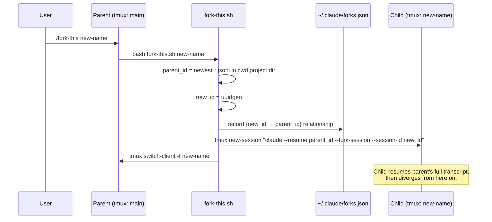
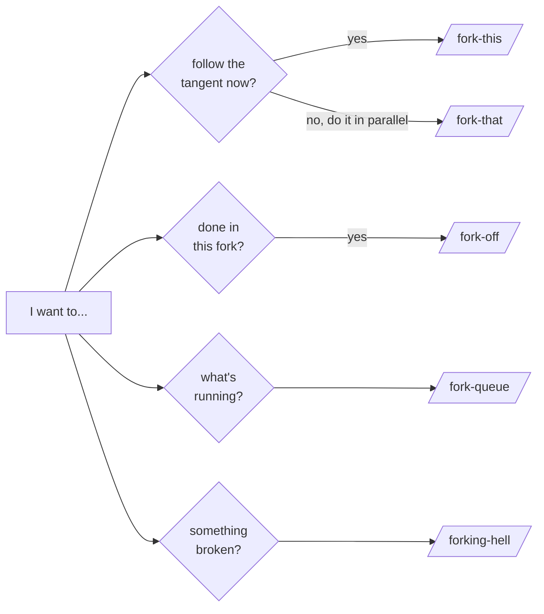

# get-forked

Fork your Claude Code session into parallel workstreams.

Each fork is a fresh Claude Code process resumed from the parent's conversation checkpoint, running in its own named tmux session. Spawn a fork to chase a rabbit hole, kick off background work, or split exploration without losing the main thread.

```
parent
├── refactor-api      ◀ current
│   └── try-async
├── debug-flaky-test
└── docs-pass
```

## Why

Claude Code conversations are linear. Sometimes you want them to branch:

- **Explore a tangent** without polluting the main thread, then drop back where you left off.
- **Kick off parallel work** — let one fork triage PRs while you keep coding in another.
- **A/B different approaches** from a known-good checkpoint and compare the diffs.

`get-forked` wraps `claude --resume --fork-session` with tmux session management and a tiny state file so you can keep track of what's running.

## Requirements

- [Claude Code](https://docs.anthropic.com/en/docs/claude-code/overview) (`claude` CLI on PATH)
- `tmux`
- `jq`
- `uuidgen` (standard on macOS/Linux)

## Install

```bash
git clone https://github.com/lavabyrd/get-forked.git
cd get-forked
./install.sh
```

The installer copies:

- `scripts/*.sh` → `~/.claude/scripts/`
- `commands/*.md` → `~/.claude/commands/` (slash commands)
- `skills/get-forked/SKILL.md` → `~/.claude/skills/get-forked/`
- initialises `~/.claude/forks.json` if it doesn't exist

To uninstall: `./uninstall.sh`.

## Commands

| Command | What happens |
|---------|-------------|
| `/fork-this <name>` | Fork the current session and switch to it (you become the fork). |
| `/fork-that <name>` | Fork into a detached tmux session and stay where you are. |
| `/fork-off` | Close the current fork, switch back to its parent. Refuses if children exist; pass `--force` to recursively kill them. |
| `/fork-queue` | Print the fork tree with current session highlighted. |
| `/forking-hell` | Run diagnostics on the setup (deps, scripts, state file, current session). |

Names are required so you can find the fork again in `tmux ls` and `/fork-queue`.

## Examples

### Chase a tangent, then come back

You're deep in a refactor and notice a flaky test. Fork off to investigate without losing context.

```text
You    > /fork-this debug-flaky-test
Claude > Forked to debug-flaky-test — switched to new tmux session.

# ... in the fork, dig into the test, fix it, commit ...

You    > /fork-off
# back in the parent session with the refactor still in progress
```

### Spawn parallel background work

Kick off PR triage in a detached fork while you keep coding.

```text
You    > /fork-that triage-renovate-prs
Claude > Forked to triage-renovate-prs — running detached. You remain here.

You    > /fork-queue
Claude >
        main ◀ current
        └── triage-renovate-prs

# attach to it later:
$ tmux attach -t triage-renovate-prs
```

### A/B two implementations from the same starting point

```text
You    > /fork-that try-rust
You    > /fork-that try-go
You    > /fork-queue
Claude >
        main ◀ current
        ├── try-rust
        └── try-go
```

Both forks resume from the same conversation checkpoint and diverge from there. Compare diffs at the end.

## How it works



In words:

1. The current session's UUID is the most recent `*.jsonl` under `~/.claude/projects/<cwd-hash>/`.
2. The script generates a new UUID for the child, records the parent → child relationship in `~/.claude/forks.json`, and spawns `claude --resume <parent> --fork-session --session-id <new>` inside a new tmux session named after the fork.
3. Because the new process resumes the parent's transcript with `--fork-session`, the child sees the full conversation history at the point of branching, then diverges.

### Which command does what



## State file

`~/.claude/forks.json` tracks the tree:

```json
{
  "sessions": {
    "<uuid>": {
      "name": "try-rust-rewrite",
      "parent": "<parent-uuid>",
      "children": [],
      "created_at": "2026-05-13T10:00:00Z",
      "cwd": "/path/to/repo"
    }
  }
}
```

The file is safe to delete — it only powers `/fork-queue` and `/fork-off`'s parent-lookup. Existing tmux sessions keep running.

## Gotchas

- **Pending tool calls**: don't fork while the parent has a tool call mid-flight. The child resumes in a confused state.
- **Same files**: forks share no awareness of each other. Two forks editing the same path will silently overwrite each other.
- **`/fork-off` keeps the window**: well, it kills the tmux session. But it does NOT delete the underlying Claude Code session transcript — that lives on under `~/.claude/projects/`.
- **No tmux = no forks**: all commands require an active tmux session. Start one with `tmux new -s main` before forking.

## Layout

```
get-forked/
├── .claude-plugin/plugin.json   plugin manifest (for `claude --plugin-dir`)
├── scripts/                     bash scripts installed to ~/.claude/scripts/
├── commands/                    slash commands installed to ~/.claude/commands/
├── skills/get-forked/           the SKILL.md that tells Claude how to use them
├── install.sh
├── uninstall.sh
└── README.md
```

## License

MIT — see [LICENSE](LICENSE).
